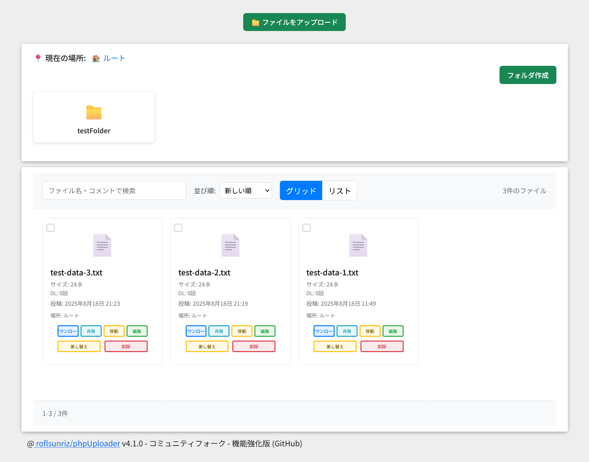

# Enhandiy v4.3.7

## 🎉 概要

Enhandiy v4.3.7 は、モダン UI・再開可能アップロード・フォルダ管理・強力なセキュリティ・REST API を備えたファイルアップローダーです。README はインデックスのみを記載し、詳細は各ドキュメントへ分割しました。

> 注意: `/api/*` を利用するには Web サーバーで `/api/index.php?path=/api/*` へのリライト設定が必要です。詳細は [API.md](docs/API.md) の「付録: ルーティング設定例（Apache / Nginx）」を参照してください。

## 📚 ドキュメントインデックス

- **概要・主要機能**: [guide-overview.md](docs/guide-overview.md)
- **インストールと要件**: [guide-installation.md](docs/guide-installation.md)
- **設定ガイド**: [guide-configuration.md](docs/guide-configuration.md)
- **データベースとマイグレーション**: [guide-database-and-migration.md](docs/guide-database-and-migration.md)
- **重要な変更点（バージョン別）**: [guide-important-changes.md](docs/guide-important-changes.md)
- **Docker クイックスタート**: [guide-docker.md](docs/guide-docker.md)
- **セキュリティノート**: [guide-security.md](docs/guide-security.md)
- **開発・リリース手順**: [guide-development.md](docs/guide-development.md)
- **REST API リファレンス**: [API.md](docs/API.md)

## 🔗 関連

- **リリース**: [リリースページ](https://github.com/roflsunriz/Enhandiy/releases)
- **CHANGELOG**: [CHANGELOG.md](CHANGELOG.md)
- **リリースノート**: `docs/RELEASE_NOTES_v*.md`

## 📄 License

### **コミュニティフォーク版 (v4.3.7)**
Copyright (c) 2025 roflsunriz  
Released under the MIT license  
<https://github.com/roflsunriz/Enhandiy/blob/main/LICENSE>

### **オリジナル版**
Copyright (c) 2025 shimosyan  
Released under the MIT license  
<https://github.com/shimosyan/phpUploader/blob/master/MIT-LICENSE.txt>

---

## 🙏 謝辞

**コミュニティフォーク版について**: この拡張版は、shimosyan氏による優れたオリジナルphpUploaderプロジェクトの基盤の上に構築されています。

**フォーク管理者**: @roflsunriz  
**オリジナルプロジェクト**: shimosyan/phpUploader

**Full Changelog**: <https://github.com/roflsunriz/Enhandiy/compare/v4.3.7...v4.3.7>

Enhandiyをご利用いただき、ありがとうございます！ 🚀
