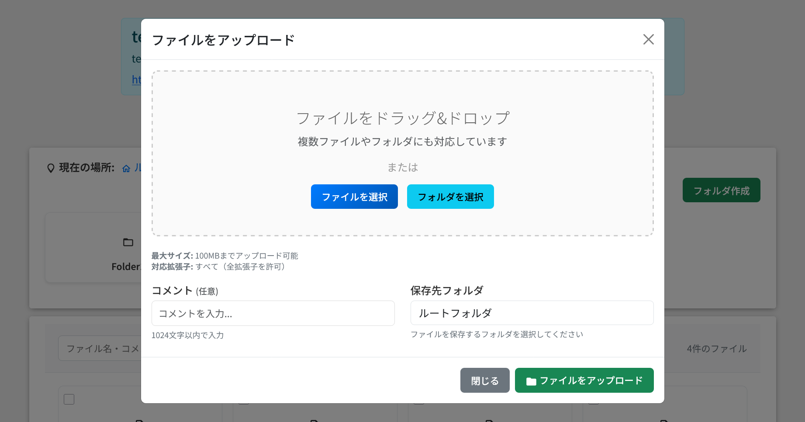
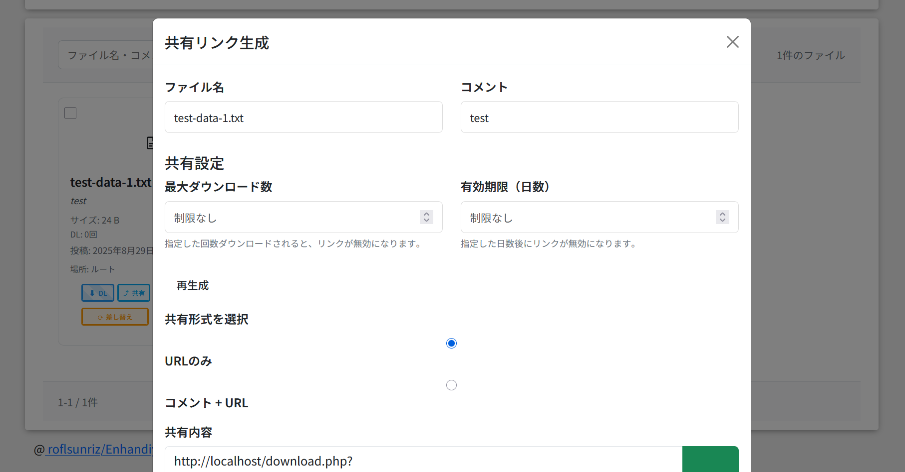
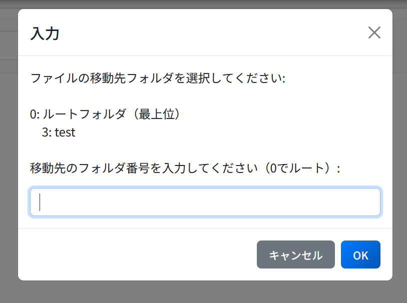
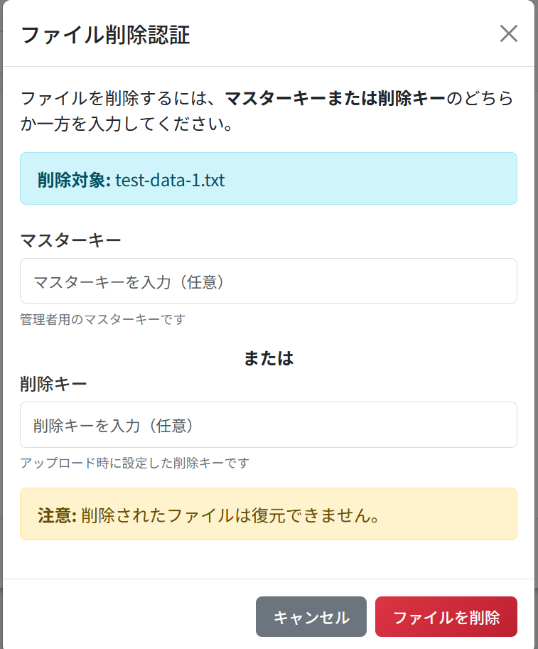
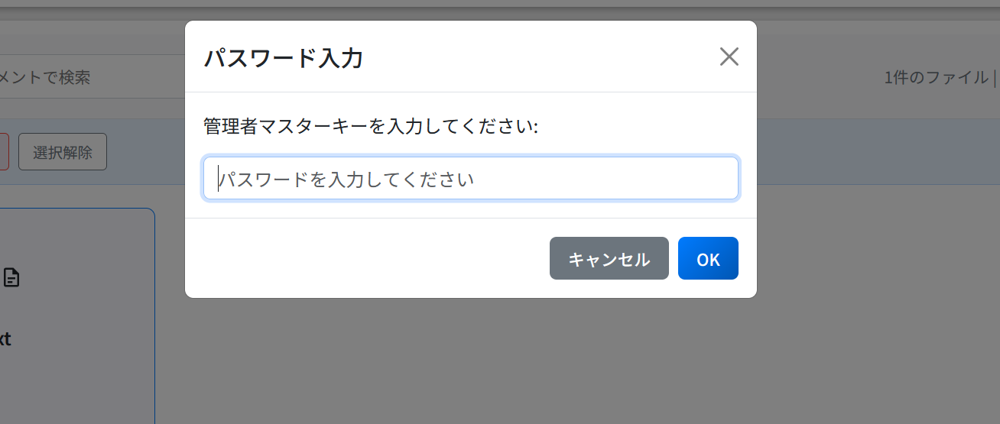
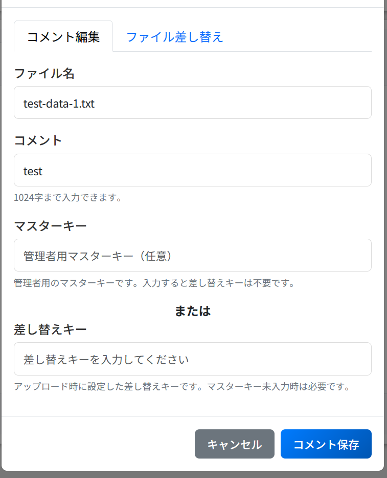
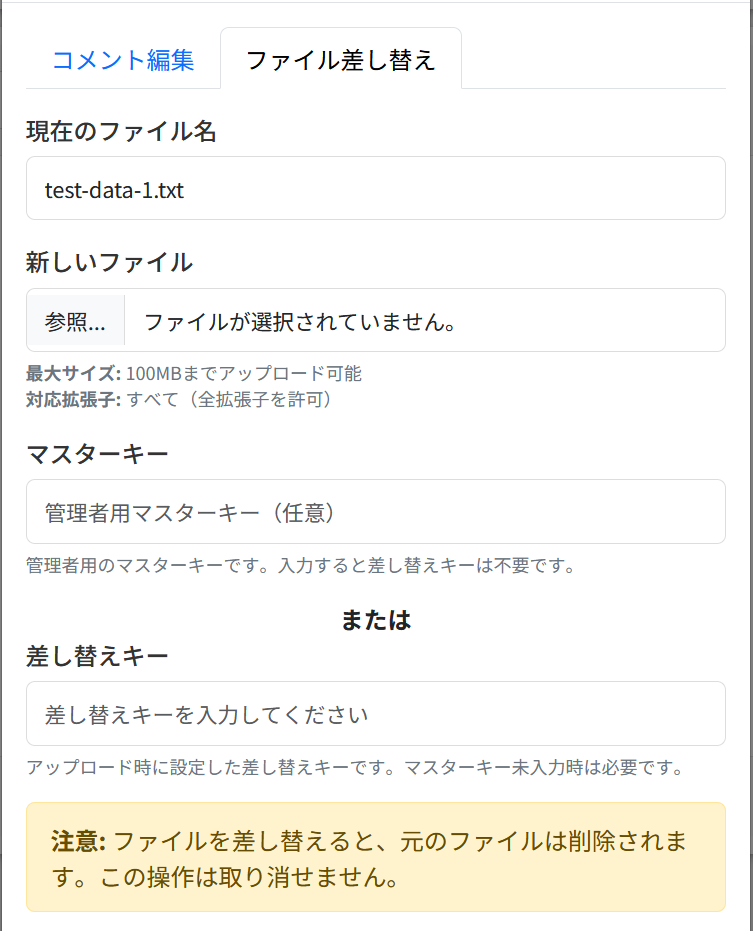

## アップロードフォーム
コメント、フォルダ指定、DLキー、削除キー、差し替えキーを指定できます。削除キーと差し替えキーはセキュリティのため必須設定です。

## 共有
最大ダウンロード数と有効期限を設定できます。URLの自動コピーの他に、コメント付きURLを生成できます。

## ファイル移動
ファイルをフォルダ間で移動できます。

## ファイル削除
ファイルを削除できます。削除キーか管理者マスターキーのどちらかが必要です。

## 一括削除
ファイルを一括削除できます。管理者マスターキーが必要です。

## コメント編集
コメントを編集できます。差し替えキーか、マスターキーのどちらかが必要です。

## ファイル置換
ファイルを置換できます。差し替えキーか、マスターキーのどちらかが必要です。

