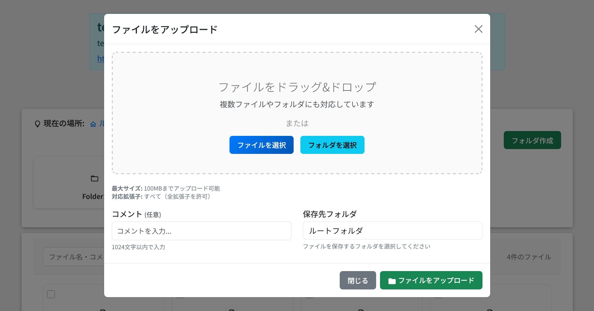

# 概要と主要機能

phpUploader v4.3.2-roflsunriz は、オリジナルの phpUploader をベースに大幅に機能強化されたコミュニティフォーク版です。モダンな UI、高度なアップロード機能、包括的な API サポート、強化されたセキュリティ機能、一括操作、パスワード強度チェック、そして包括的なファイル管理機能を提供します。

## 主要機能

### モダンファイルマネージャー
- グリッド/リスト表示: 美しいカード形式のファイル表示とビュー切り替え
- 高度な検索・ソート: リアルタイムファイル検索と複数のソートオプション
- ページネーション: 大量ファイルの効率的な表示
- レスポンシブデザイン: 全デバイス対応のモバイルフレンドリーなインターフェース
- リアルタイム更新: jQuery 依存を排し、モダン JS による高速レスポンス
- 動的更新: 操作後の自動ファイルリスト更新とステータス同期

### フォルダ管理システム
- 階層フォルダ: ネストしたフォルダ構造の作成・管理
- フォルダナビゲーション: パンくずナビで直感的ブラウジング
- 設定可能な深度: カスタマイズ可能な最大フォルダ深度と制限

### 高度なアップロード機能
- ドラッグ＆ドロップアップロード: 複数ファイル対応のモダン UI
- 再開可能アップロード: Tus.io による大容量アップロードの一時停止・再開
- 進捗追跡: 速度表示付きのリアルタイム進捗
- フォールバック対応: 再開可能アップロード失敗時の従来方式への自動切替

### ファイル共有・リンク機能
- 共有リンク生成: 安全で期限付きの共有リンクを作成
- DL キー未設定対応: ダウンロードキーがないファイルにも対応
- カスタマイズ可能な有効期限: 共有ファイルの有効期限をカスタム設定
- ダウンロード制限: 共有リンクごとの最大ダウンロード回数制御
- 動的更新: モーダル内リアルタイム反映とクリップボード連携

### 一括選択・操作機能
- ファイル一括選択: 複数ファイルを効率的に選択
- 全選択機能: ワンクリックで表示中の全ファイルを選択
- マスターキー認証: 管理者による安全な一括削除（マスターキーのみ）
- 選択状態表示: 選択数の視覚的フィードバック

### ファイル管理・編集機能
- コメント編集: ファイルマネージャーから直接編集
- ファイル差し替え: メタデータを維持した差し替え
- 差し替えキー認証: 安全な差し替えのためのキー検証
- 削除キー強化: 削除キー必須化による安全な個別削除

### セキュリティ・柔軟性の強化
- パスワード強度チェック: リアルタイム評価と視覚的フィードバック
- 削除キー必須化: アップロード時に削除キー設定を必須化
- 統一暗号化: AES-GCM による強化されたセキュリティ（旧方式互換）
- 柔軟な DL キー: ダウンロードキーの必須/任意を設定で切替
- 差し替えキーシステム: 暗号化キー検証による安全な差し替え
- CSRF 保護: CSRF トークン検証
- レート制限: API 悪用防止のレート制限
- 弱パスワード拒否: よく使われる危険なパスワードの自動検出・拒否

### RESTful API（概要）
- 完全な REST API: 主要なファイル操作をカバー
- 複数認証方式: Bearer トークン、API キー、クエリパラメータ認証
- CORS 対応: Web アプリ向けクロスオリジンをサポート
- 包括的ドキュメントと標準化エラーレスポンス

注意（ルーティング）:
- `/api/*` を利用するには Web サーバーで `/api/index.php?path=/api/*` へ書き換える設定が必要です。詳細は `docs/API.md` の「付録: ルーティング設定例（Apache / Nginx）」を参照してください。

関連ドキュメント:
- API リファレンス: `docs/API.md`
- インストール: `docs/guide-installation.md`
- 設定: `docs/guide-configuration.md`

